# Проект: LLM-Proxy API
Сервис на FastAPI для защищенного взаимодействия с LLM (OpenRouter) с использованием JWT-авторизации, SQLite и архитектурного разделения слоев.

## Установка и запуск через uv
Установка зависимостей
`uv pip install -r <(uv pip compile pyproject.toml)`

Запуск приложения
`uv run uvicorn app.main:app --reload --host 0.0.0.0 --port 8000`
Доступ к Swagger по ссылке: `http://127.0.0.1:8000/docs`

## Демонстрация работы
### Общий вид
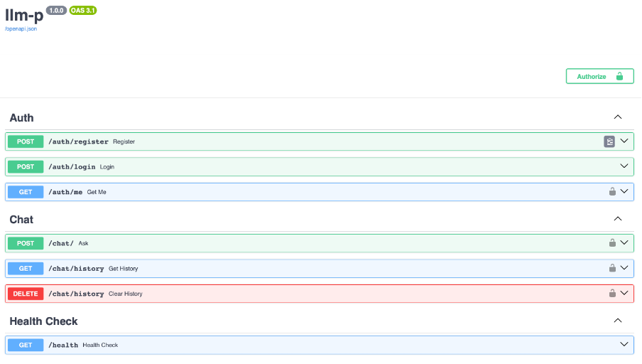
### 1. Регистрация пользователя
Критерий: Email в формате student_surname@email.com, хеширование пароля.
Тест: Регистрируем пользователя с паролем  «password».
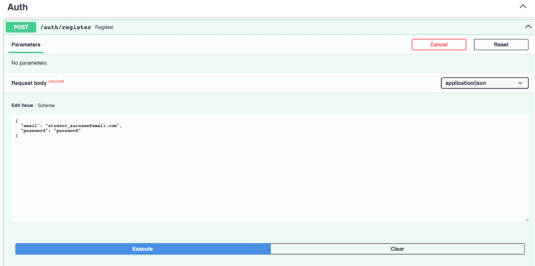
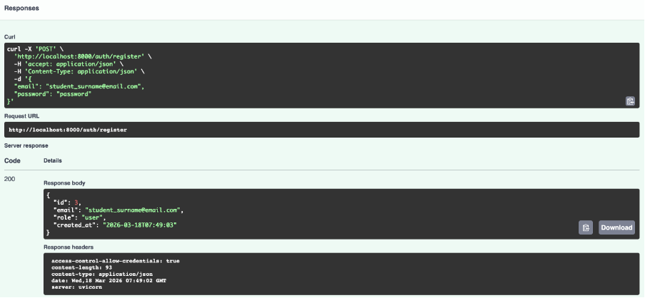

### 2. Логин и получение JWT
Критерий: Аутентификация по email/паролю, выдача JWT.
Тест: Вводим данные зарегистрированного пользователя и получаем токен.
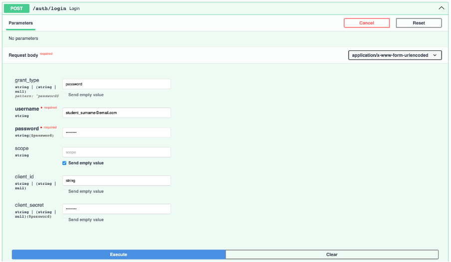
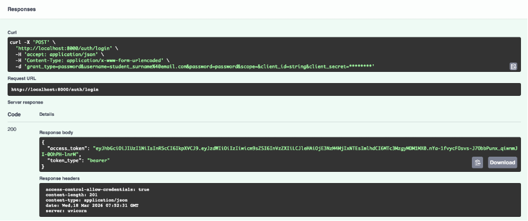
### 3. Авторизация в Swagger
Критерий: Корректное использование кнопки Authorize.
Тест: Вставляем полученный токен в поле Bearer token и нажимаем “Authorize”, затем “Close”.
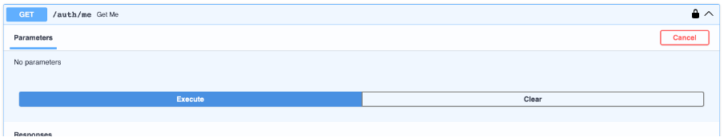
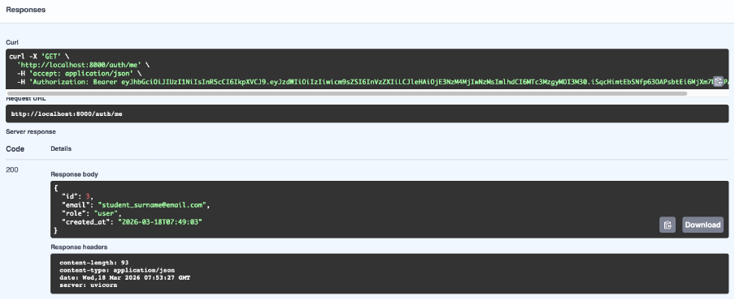
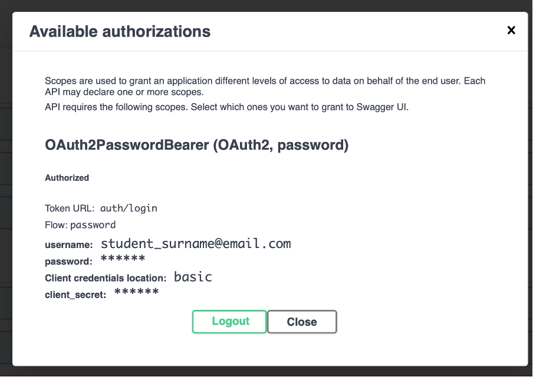

### 4. Запрос к LLM (POST /chat)
Критерий: Обработка запроса, вызов OpenRouter, сохранение в БД.
Тест: Отправляем запрос, используя токен.
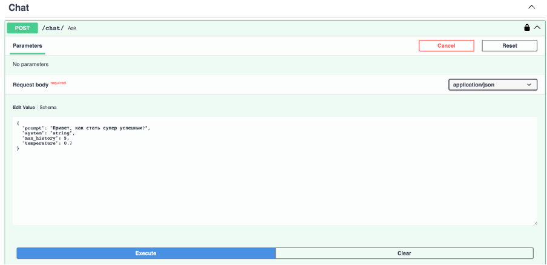
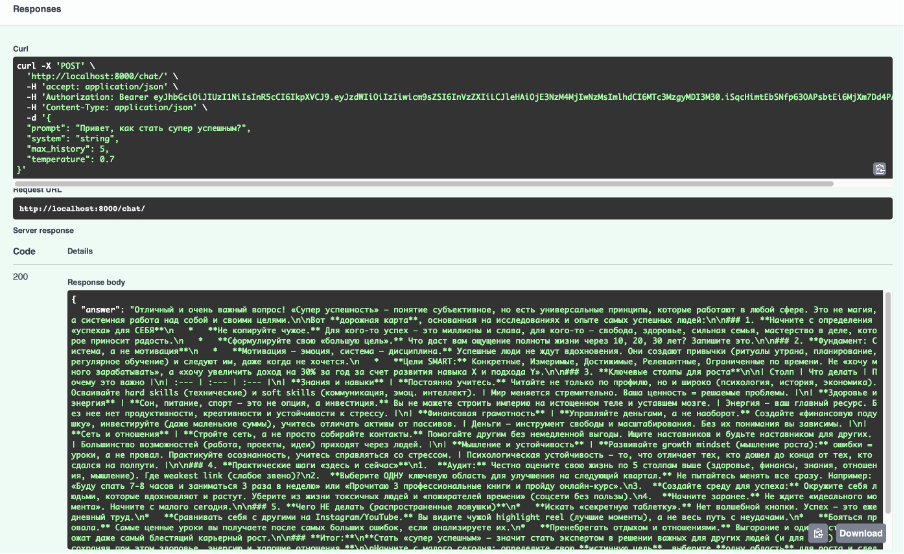
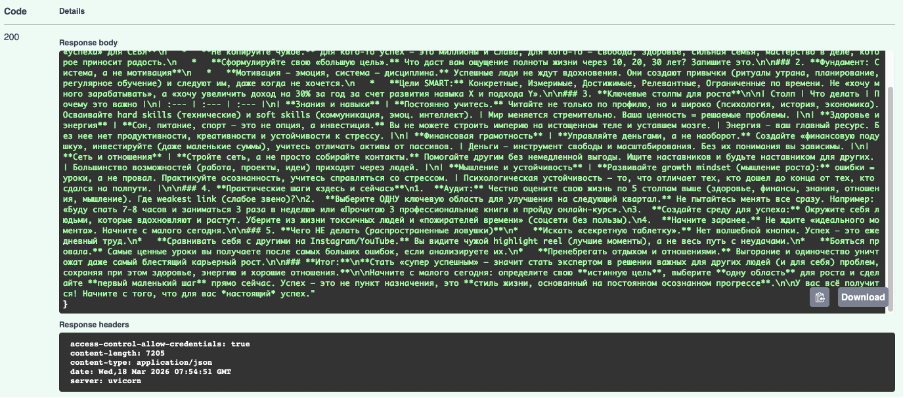

### 5. Просмотр истории (GET /chat/history)
Критерий: Возврат истории, привязанной к текущему пользователю.
Тест: Проверяем, что запрос и ответ LLM сохранились.
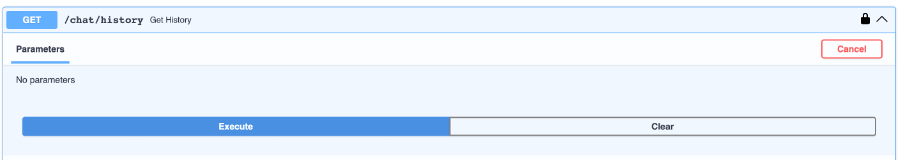
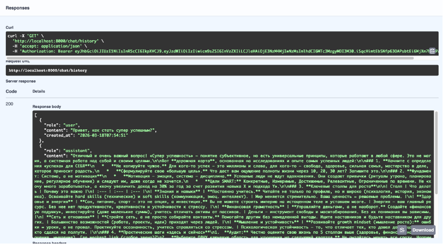
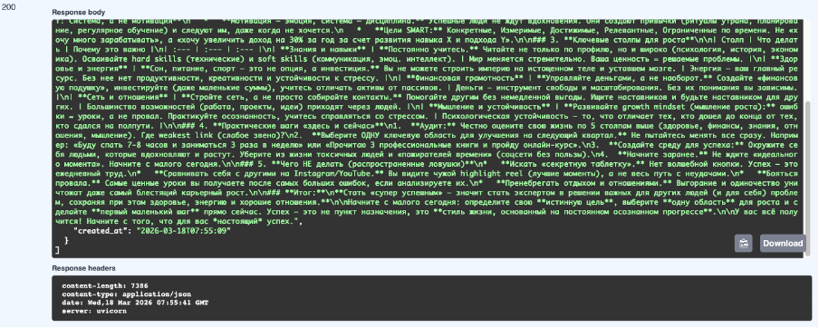

### 6. Очистка истории (DELETE /chat/history)
Критерий: Корректное удаление записей из БД.
Тест: Очищаем историю.
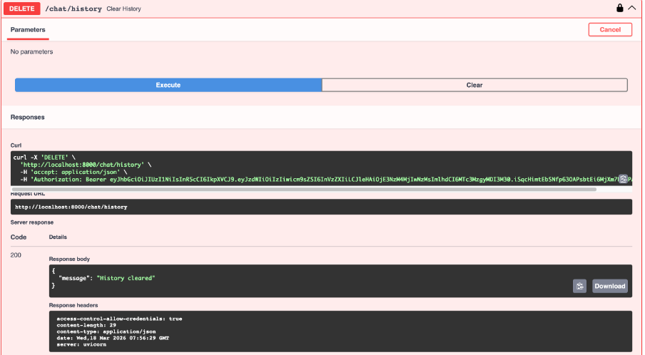
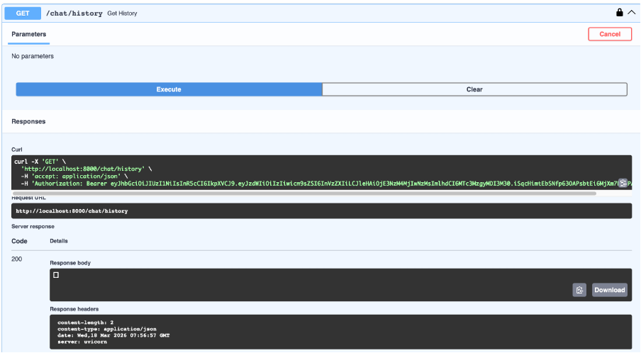